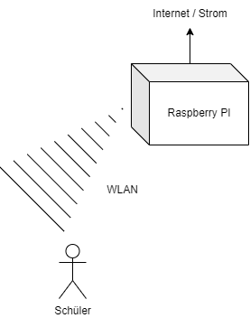

# KIDI

## Technische Umfeld

Lehre Raspberry-PI, der ein WLAN aufspannt in dem sich die Schüler z.B. mit ihrem Smartphone / Tablet anmelden können.

Auf dem Raspberry PI sind alle Lernsituation (Experimente) enthalten. Diese werde bei jedem Boot des Raspberry PIs über dieses Repository aktualisiert.

## Die Lernsituationen

Die Lernsituationen zu diesem Kurs können [hier](https://jtuttas.github.io/kidi/site/) geladen werden.

